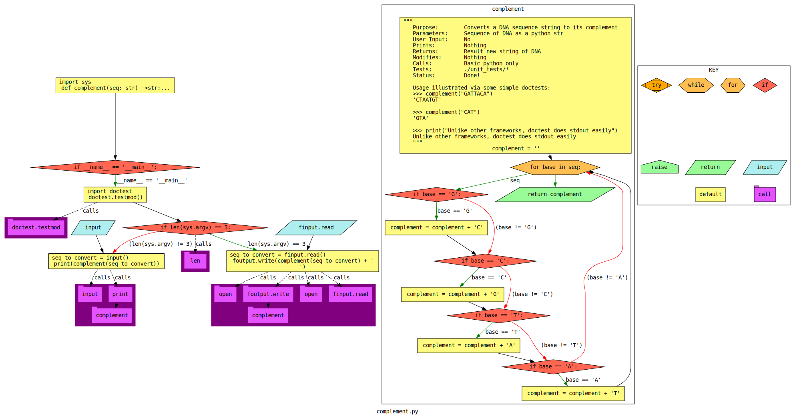

"Think Global, Code Local"
    - Me


# Programming Assignmeng 00 (pa00)
Get comfortable with a local development environment,
version control, programm I/O, and the autograder.
This is a pre-assignment assignment,
to make sure you know how to handle the environment,
before we do real work.

For those of you in non-CS backgrounds,
you will likely learn a thing or two.

For the CS students, this is a brief reminder,
and a push to learn more pandas and numpy!

# Part 0: Review the basics
Actually review the following (you should know this already, but if not, now is the time!):
* https://cs-mst.gitlab.io/index/Classes/DataStructuresLab/Content/00-VirtualMachines.html
* https://cs-mst.gitlab.io/index/Classes/DataStructuresLab/Content/01-02-LinuxBash.html
* https://cs-mst.gitlab.io/index/Classes/DataStructuresLab/Content/03-VersionControl.html
* https://cs-mst.gitlab.io/index/Classes/ComputationalThinking/Content/11-TypeHints.html
* https://cs-mst.gitlab.io/index/Classes/ComputationalThinking/Content/16-TypeFormatDebug.html
* https://cs-mst.gitlab.io/index/Classes/ComputationalThinking/Content/18-InputOutput.html
* https://scipy-lectures.org/intro/index.html

# Part 1: Set up your machine
I provide a docker container (Fedora), but you can use any Linux that works.
The python3-pip package scikit-bio works on Fedora 38, and likely on OpenSuse or Debian.
On Windows hosts or x86 Mac, VirtualBox is great.
On an ARM Mac, you may need Paralells or UTM.

See the `containers/` directory.
It has scripts to install everything you need in either a Fedora VM or run a container.

# Part 2: Get your repository onto your machine
In your VM OS, open Firefox.
Log into https://git-classes.mst.edu using your MST SSO credentials.
In the git-classes web interface, set up a token or ssh key.
Then, in the git-classes web interface, find the repository for this assignment,
note the blue "clone" button/link; copy it https for token, or ssh for ssh.
In your class VM, open a terminal, and run these commands:
```sh
cd
tree 
cd Documents/CS****/ # where **** is your class (create if needed)
git clone --recurse-submodules <yourlink>
cd therepodirectoryyoujustcloned
```
In case it was not clear, 
you need to replace parts of the commands above with information specific to you.

# Part 3: Run the auto-grader
Run the following in the root directory of your repository:
`./grade.sh`

## Errors
You should not change any of the grading files themselves. 
If you do, you will see a warning, and it will give you a 0.
If you accidentally did that:
`git checkout firstfourcharactersoflastcommitbyus graderfileyoubroke`

## Is the auto-grader broken?
Is the error you're encountering our fault or yours?
Either may be possible, while the latter is much more likely.
Double-check all the diffs, and step through all code to see.
If you think you found a bug, please let us know!

# Part 4: Do the assignment

## How to code?
Let the autograder guide you! 
It's usually a good idea to do work in the order the autograder checks you.
Using this script, we strongly encourage you to program incrementally. 
Program code required by the unit tests, in the requested order. 
In general, don't procede to a later function, if you are not passing the first one.
If you get stuck, instead of moving on, get help!
See the syllabus for extended coding tips.

## Sample problem description
An introductory assignment: Complement a DNA sequence string

### Problem description
Write a function that takes a DNA sequence as a string,
and returns it's complement.
Write a main driver that uses this function,
and handles various methods of input and output.
It will be expeted to have a variety of input and output mechanisms,
which you can see with the autograder.

### Control Flow Graph (CFG) generated from your code

This is a hint!

# Part 5: Play with the debugger
1. pudb
```sh
man pudb # or man pudb3 depending on your machine
pudb complement.py
```
Practice stepping into the function and through the for loop with pudb3.
Take a screenshot while you are still in pudb3 (before quitting), and name it `image_py-debug1.png`

2. Open the same file in Spyder3 and practice stepping through it using the debugger 
(read the manual for help).
Take a screenshot and name it `image_py-debug2.png`

# Part 6: Try some diff methods
In the virtual machine, run at the bash command line:
```sh
diff -y --color "unit_tests/unit_test_1.py" "unit_tests/unit_test_10.py"

vim -d "unit_tests/unit_test_1.py" "unit_tests/unit_test_10.py"
# To exit vim, type esc followed by :qa

meld --diff "unit_tests/unit_test_1.py" "unit_tests/unit_test_10.py"
```
Take a screenshot of the result of these commands arranged in view,
and name it `image_diff.png`
caPitAliZAtiOn matters, including of the `.png` part. 
Check it!

# Part 7: Use jupyter/jupytext for notebooks
1. Launch `jupyter lab`
2. Use jupyter menu to create a jupytext notebook named `bioinformatics.py` in "percent format".
If your jupyter menu mis-behaves, then you can just create and ipynb, 
and convert it to py using jupytext...
3. Write your script using jupyter lab, 
which may include something like this,
and needs to write the relevant output to a file.

```python
import skbio

skbio.title
skbio.art
```
Your script file output should match `jupyter_out_goal.txt`
Don't try to draw the art yourself...!

# Part 8: Interact with the upcoming lecture notes
1. In a different directory (not this Git repo), clone the repository for the upcoming lecture notes:
`git clone https://gitlab.com/bio-data/sequence-informatics.git`
2. Use jupyter lab to open the first two "chapters" notebook scripts, and excute them.

# Part 9: Wrangle some pandas...
Learn a bit of NumPy and practice basic data-wrangling using python pandas!


pandas has created pandamonium in the data science world!

A great way to pander to the needs of your data… as you ponder the dataset’s deeper meaning.

Read as much as this as you can:
https://numpy.org/doc/stable/user/index.html#user

Do the tutorials here, following along yourself in jupyter:
https://pandas.pydata.org/pandas-docs/stable/getting_started/index.html

Save the results in a jupyter jupytext notebook within the root directory of your repo,
named `pandas_explore.py`
I'm not verifying that everything is exactly identical,
but that most of the demos have bee tried,
and you have played around with the examples.

# Part 10: Submit your work!
Finally, to submit all your work, it is time to manage these files you created within your Git repository.
They must all be in the folder created when you cloned your Git repository.
From within your git repository (folder), add, commit, and push all the non-generated files. 
This means add your cpp and py files, for example, but not a.out, etc.
These commands should move your edits to the repository to the git-classes server:
```sh
git add file1
git add file2
# where you do this for all your files
git commit -m "Time to git committed to this ;)"
git push -u origin master
```

# Part 9: Check your work!
Read the resulting message Git prints!
Most importantly, to check all your previous Git-related steps worked,
using the web browser, navigate back to the repository,
and confirm all the files you added are visible in the Gitlab web interface.
If the files are not visible,
then you will not be graded for them,
and you should go ask for help!
If you can see the correct files on git-classes in your main branch,
then your push is complete.
Make sure all the requested files are in the root directory of the repository,
unless otherwise specified.

To determine whether your project is finished:
Check out the git-classes Gitlab CI (details in the general syllabus). 
If it turns green AND the details show a 100,
then you're good! 
If it's still red or you are less than 100,
then you need to fix your project.
This test checks both that you got your files submitted correctly,
and that your submission was correct!

## How to make sure I'm getting points?
Click on CI/CD -> Jobs -> the latest job.
What grade does it say you have?
Whatever grade the latest job says,
is what we think you have!
