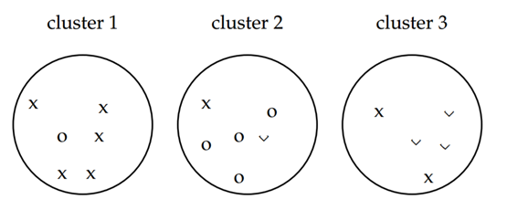
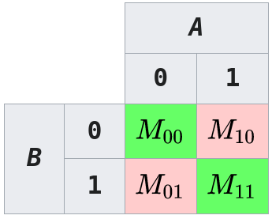
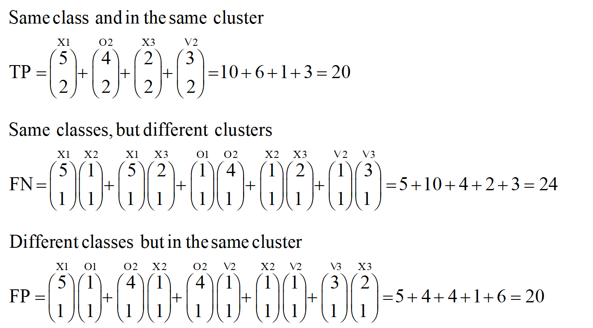
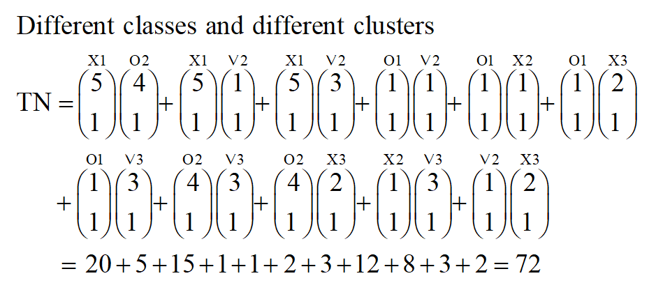

# Score the quality of a clustering instance

## Look-ahead
Our next assignment will involve clustering cancer data,
and dimensionality-reduction on the same data.
This is a pre-requisite assignment to that one, 
which will help us evaluate that process.

## Assignment
Write the functions in `rand.py`.
Read the python files in `tests/unit_tests/`.
Don't use any imports other than numpy!
Don't use sklearn's `rand_score`, or other sklearn or scipy functions.
Write these functions yourself, 
using nothing other than matrix operations.

## Background reading
https://scikit-learn.org/stable/modules/clustering.html#clustering-performance-evaluation

## Data example
Below is an example clustered dataset.
How do we determine how good this clustering job is??

Here are the data in graphic form:



In labeled text form:

Cluster 1:
x x x x x o 

Cluster 2:
x o o o o v

Cluster 3:
x x v v v

In data form:

Item-I, True-T, Predicted-P
```
I  T P

01 x 1
02 x 1
03 x 1
04 x 1
05 x 1
06 o 1
07 x 2
08 o 2
09 o 2
10 o 2
11 o 2
12 v 2
13 x 3
14 x 3
15 v 3
16 v 3
17 v 3
```

## Contingency tables
Given a set S, of n elements 
$S = \{o_1, \ldots, o_n\}$
and two groupings or partitions (i.e., clusterings) of S to compare, 
$X = \{X_1, \ldots, X_r\}$, 
a partitioning (clustering) of S into r subsets, and 
$Y = \{Y_1, \ldots, Y_s\}$, 
a partitioning (clustering) of S into s subsets, define the following:

$X = \{ X_1, X_2, \ldots , X_r \}$ and 

$Y = \{ Y_1, Y_2, \ldots , Y_s \}$, 

the overlap between X and Y can be summarized in a contingency table 

$\left[n_{ij}\right]$

where each entry $n_{ij}$

denotes the number of objects in common between $X_{i}$ and $Y_j$ : 

$n_{ij}=|X_i \cap Y_j|$


Contingency table:
```
  | 1 | 2 | 3
--+---+---+---
x | 5 | 1 | 2
--+---+---+---
o | 1 | 4 | 0
--+---+---+---
v | 0 | 1 | 3
```
Contingency matrix reports the intersection cardinality for every true/predicted cluster pair.

## Confusion matrices
https://en.wikipedia.org/wiki/Confusion_matrix


Where accuracy (ACC) can be defined, based on the following sub-definitions:

TP is the number of true positives,
TN is the number of true negatives,
FP is the number of false positives,
and FN is the number of false negatives.

How do we calculate accuracy from the confusion matrix?

$ACC = {\frac {TP+TN}{TP+FP+FN+TN}} = {\frac {TP+TN}{P + N}}$

With supervised classification learning, 
calculating those categories is trival.
With unsupervised clustering, 
how do we calculate them?
How do you know which cluster is the correct or incorrect?
Does the mode per cluster suffice?
Can we assume all possible clusters are correct?
Can we simplify a dataset to it's extreme limit, to make this doable?
What about clustering an `n` of 2?

Item-I, True-T, Predicted-P
```
I  T P

01 x 1
02 o 1
```
With table:
```
  | 1 | 2 |
--+---+---+
x | 1 | 0 |
--+---+---+
o | 1 | 0 |
--+---+---+
```
That's a false positive.

Item-I, True-T, Predicted-P
```
I  T P

01 x 1
02 x 2
```
With table:
```
  | 1 | 2 |
--+---+---+
x | 1 | 1 |
--+---+---+
o | 0 | 0 |
--+---+---+
```
That's a false negative.

Item-I, True-T, Predicted-P
```
I  T P

01 x 1
02 x 1
```
With table:
```
  | 1 | 2 |
--+---+---+
x | 2 | 0 |
--+---+---+
o | 0 | 0 |
--+---+---+
```
That's a true positive.

Item-I, True-T, Predicted-P
```
I  T P

01 x 1
02 0 2
```
With table:
```
  | 1 | 2 |
--+---+---+
x | 1 | 0 |
--+---+---+
o | 0 | 1 |
--+---+---+
```
That's a true negative.

Does it matter if I swap the names for 1 and 2?
No!

## Binomial coefficient

https://en.wikipedia.org/wiki/Binomial_coefficient

https://mathworld.wolfram.com/BinomialCoefficient.html

The binomial coefficient ${n \choose k}$ defines:
the number of ways of picking k unordered outcomes from n possibilities,
also known as a combination or combinatorial number.
We can state this as "n choose k".

For example, 
The 2-subsets of {1,2,3,4} include six pairs:
{1,2}, {1,3}, {1,4}, {2,3}, {2,4}, and {3,4}.
So, ${4 \choose 2} = 6$.

One solution to the above problem of not knowing which clusters are which,
is to define all the possible pairs (k=2) of items in our set S, of n elements:
${n \choose 2}$

In this way, we can thus calculate the following tally,
using every single pairing as a data-point:

```
+--------------------------------+--------------------------------------+
| TP:                            | FN:                                  |
| Same class + same cluster      | Same class + different clusters      |
+--------------------------------+--------------------------------------+
| FP:                            | TN:                                  |
| different class + same cluster | different class + different clusters |
+--------------------------------+--------------------------------------+
```

## Rand index
https://en.wikipedia.org/wiki/Rand_index

https://en.wikipedia.org/wiki/Simple_matching_coefficient

We can then extend the above tally of all pairings into the same accuracy calculation as before.
The Rand index as a measure of the percentage of correct decisions made by the algorithm.

$RI={\frac {TP+TN}{TP+FP+FN+TN}}$

Phrased slightly differently:

$RI = \frac{a+b}{n \choose 2} = \frac{correct\ similar\ pairs + correct\ dissimilar\ pairs}{total\ possible\ pairs}$

Given a set S, of n elements 
$S = \{o_1, \ldots, o_n\}$
and two groupings or partitions (i.e., clusterings) of S to compare, 
$X = \{X_1, \ldots, X_r\}$, 
a partitioning (clustering) of S into r subsets, and 
$Y = \{Y_1, \ldots, Y_s\}$, 
a partitioning (clustering) of S into s subsets, define the following:

a. (TP) the number of pairs of elements in S that are in the same subset in X and in the same subset in Y

b. (TN) the number of pairs of elements in S that are in different subsets in X and in different subsets in Y

c. (FP) the number of pairs of elements in S that are in the same subset in X and in different subsets in Y

d. (FN) the number of pairs of elements in S that are in different subsets in X and in the same subset in Y

The Rand index:

$R = \frac{a+b}{a+b+c+d} = \frac{a+b}{{n \choose 2 }}$

a + b can be considered as the number of agreements between X and Y, and 
c + d as the number of disagreements between X and Y. 

Since the denominator is the total number of pairs, 
the Rand index represents the frequency of occurrence of agreements over the total pairs,
or the probability that X and Y will agree on a randomly chosen pair.

${n \choose 2}$ is calculated as $n(n-1)/2$

Which is a special case of the Binomial Coefficient above, generally calculated as:
${n \choose k}={\frac {n!}{k!(n-k)!}}$

We can think of this more generally:
The simple matching coefficient (SMC) is a statistic used for comparing the similarity and diversity of sample sets.



Given two objects, A and B, each with n binary attributes, SMC is defined as: 

$SMC={\frac {\text{number of matching attributes}}{\text{sum of all attributes}}}$

$SMC={\frac {M_{00}+M_{11}}{M_{00}+M_{11}+M_{01}+M_{10}}}$

where:

$M_{00}$ is the total number of attributes where A and B both have a value of 0.

$M_{11}$ is the total number of attributes where A and B both have a value of 1.

$M_{01}$ is the total number of attributes where the attribute of A is 0 and the attribute of B is 1.

$M_{10}$ is the total number of attributes where the attribute of A is 1 and the attribute of B is 0.

A reminder about our Contingency table from before:

```
  | 1 | 2 | 3
--+---+---+---
x | 5 | 1 | 2
--+---+---+---
o | 1 | 4 | 0
--+---+---+---
v | 0 | 1 | 3
```

What are bad features?
* Divergence/variability/spread within a row is bad. Every pairing where one of each is in a different cell in a row is a false-negative.
* Divergence/variability/spread within a column is bad. Every pairing where one of each is in a different cell in a column is a false positive.

What are good features?
* Every single pair in single cell is good! Any pairing where both elements are cell is a correct cell, a true-positive.
* Divergence/variability/spread across any diagonal is good! Any pairing wheer elements are in two cells, diagonally oriented from each other, is a true-negative, even if it's not a 45 degree diagonal.

Here's one way to use it to calculate the confusion matrix:

TP: 
is the sum of every cell choose 2.
Calculated by applying ${n_{ij} \choose 2}$ to every cell in the matrix and taking the sum of everything (assuming that '1 choose 2' or '0 choose 2' is 0).

TP + FP: 
take the sum per column and 'choose 2' over all those values.
So the sums are [6, 6, 5] and you do '6 choose 2' + '6 choose 2' + '5 choose 2'.

TP + FN:
take the sum over the rows.
So, that is [8, 5, 4] in the example above), 
apply 'choose 2' over all those values,
and take the sum of that.

FP = (TP + FP) - TP

FN = (TP + FN) - TP

TN = (n choose 2) - TP - FP - FN

And unpacked slightly differently:



For False Negative, 
we should pick from the class but in different clusters.

1 X from cluster 1 and 1 X from cluster 2 = ${5 \choose 1}{1 \choose 1} = 5$

1 X from cluster 1 and 1 X from cluster 3 = ${5 \choose 1}{2 \choose 1} = 10$

1 O from cluster 1 and 1 O from cluster 2 = ${1 \choose 1}{4 \choose 1} = 4$

1 X from cluster 2 and 1 X from cluster 3 = ${1 \choose 1}{2 \choose 1} = 2$

1 v from cluster 2 and 1 v from cluster 3 = ${1 \choose 1}{3 \choose 1} = 3$

Finally, we will have $5 + 10 + 4 + 2 + 3 = 24$ states.

The same is for the rest of the equations.

TN can be calculated as in the below picture:



There are some shorter paths to calculate the Rand Index, 
but this is the calculation step by step.
The confusion table follows:

```
+--------+--------+
| TP: 20 | FN: 24 |
+--------+--------+
| FP: 20 | TN: 72 |
+--------+--------+
```

And finally:

$Rand Index = (20 + 72) / (20 + 24 + 20 + 72) = 0.676$

Why is this helpful:

Interpretability: The unadjusted Rand index is proportional to the number of sample pairs whose labels are the same in both `labels_pred` and `labels_true`, or are different in both.

Random (uniform) label assignments have an adjusted Rand index score close to 0.0 for any value of `n_clusters` and `n_samples` (which is not the case for the unadjusted Rand index or the V-measure for instance).

Bounded range: Lower values indicate different labelings, similar clusterings have a high (adjusted or unadjusted) Rand index, 1.0 is the perfect match score. The score range is [0, 1] for the unadjusted Rand index and [-1, 1] for the adjusted Rand index.

No assumption is made on the cluster structure:
The (adjusted or unadjusted) Rand index can be used to compare all kinds of clustering algorithms,
and can be used to compare clustering algorithms.
For example, comparing such as k-means, which assumes isotropic blob shapes,
with results of spectral clustering algorithms, which can find cluster with “folded” shapes.

Note that sklearn's confusion matrix has values double those in my example matrix,
which is functionally identical.

## Look-ahead note
When we get to the vision section of the course,
we'll need this all again!

https://en.wikipedia.org/wiki/Jaccard_index

## Git autograding
Git clone your repository onto your machine, and run the autograder.
See: [docs/git_autograding.md](docs/git_autograding.md)
